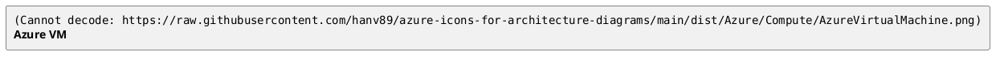

# Azure + Fabric Icons for Architecture Diagrams

Microsoft Azure architecture icons and Microsoft Fabric icons in PNG, ready for diagram-as-code via PlantUML's `` syntax. Redistributed from Microsoft-first-party MIT upstreams; reachable as public raw URLs so any PlantUML renderer (the public `plantuml.com` server, the Confluence app, the VS Code extension, GitHub's inline renderer) can fetch them at render time.

## Quick-start

Two ways to use these icons. Pick one.

### A — Install the AI skill (recommended)

Install the skill for your AI coding agent with one `npx` command:

```bash
# Claude Code
npx @hanv89/azure-arch-skill@latest install --agent=claude-code

# Codex CLI
npx @hanv89/azure-arch-skill@latest install --agent=codex

# Cursor
npx @hanv89/azure-arch-skill@latest install --agent=cursor
```

Where each agent installs the skill:

| Agent | Install location | Model |
|---|---|---|
| Claude Code | `~/.claude/skills/azure-architecture-diagram/` | per-user |
| Codex CLI | `~/.codex/skills/azure-architecture-diagram/` | per-user |
| Cursor | `<cwd>/.cursor/rules/azure-arch-skill.mdc` | per-project — see [CLI reference](#cli-reference) |

To install for every supported agent at once, use `--agent=all` (see [CLI reference](#cli-reference)).

Then in a new agent session (the example below uses Claude Code), prompt:

> Draw a system architecture diagram for an Azure AKS app feeding a Microsoft Fabric data plane (Lakehouse + Power BI).

```plantuml
@startuml
' System architecture (C4 level 2) — Azure AKS application feeding a
' Microsoft Fabric data plane.

left to right direction
skinparam linetype ortho

title Azure AKS application + Microsoft Fabric data plane

actor "End user" as user
actor "Data analyst" as analyst

rectangle "AKS application (Azure)" as aks_app {
  rectangle "<img:https://raw.githubusercontent.com/hanv89/azure-icons-for-architecture-diagrams/main/dist/Azure/Networking/AzureFrontDoor.png>\n**Front Door**\n(entry + WAF)" as fd
  rectangle "<img:https://raw.githubusercontent.com/hanv89/azure-icons-for-architecture-diagrams/main/dist/Azure/Containers/AzureKubernetesService.png>\n**AKS cluster**\n(microservices)" as aks
  rectangle "<img:https://raw.githubusercontent.com/hanv89/azure-icons-for-architecture-diagrams/main/dist/Azure/Databases/AzureSqlDatabase.png>\n**Azure SQL Database**\n(OLTP state)" as sql
  rectangle "<img:https://raw.githubusercontent.com/hanv89/azure-icons-for-architecture-diagrams/main/dist/Azure/Integration/AzureServiceBus.png>\n**Service Bus**\n(async messaging)" as sb
  rectangle "<img:https://raw.githubusercontent.com/hanv89/azure-icons-for-architecture-diagrams/main/dist/Azure/Databases/AzureRedisCache.png>\n**Cache for Redis**\n(cache)" as redis
  rectangle "<img:https://raw.githubusercontent.com/hanv89/azure-icons-for-architecture-diagrams/main/dist/Azure/Containers/AzureContainerRegistry.png>\n**Container Registry**\n(images)" as acr
}

rectangle "Platform services" as platform {
  rectangle "<img:https://raw.githubusercontent.com/hanv89/azure-icons-for-architecture-diagrams/main/dist/Azure/Identity/AzureActiveDirectory.png>\n**Microsoft Entra ID**\n(workload identity)" as entra
  rectangle "<img:https://raw.githubusercontent.com/hanv89/azure-icons-for-architecture-diagrams/main/dist/Azure/Security/AzureKeyVault.png>\n**Azure Key Vault**\n(secrets via CSI)" as kv
  rectangle "<img:https://raw.githubusercontent.com/hanv89/azure-icons-for-architecture-diagrams/main/dist/Azure/Management/AzureMonitor.png>\n**Azure Monitor**\n(observability)" as mon
}

rectangle "<img:https://raw.githubusercontent.com/hanv89/azure-icons-for-architecture-diagrams/main/dist/Fabric/png/fabric_48_color.png>\n**Microsoft Fabric workspace**" as fabric_ws {
  rectangle "<img:https://raw.githubusercontent.com/hanv89/azure-icons-for-architecture-diagrams/main/dist/Fabric/png/one_lake_48_color.png>\n**OneLake**\n(Delta foundation)" as onelake
  rectangle "<img:https://raw.githubusercontent.com/hanv89/azure-icons-for-architecture-diagrams/main/dist/Fabric/png/mirrored_catalog_40_item.png>\n**Mirrored Catalog**\n(zero-ETL Delta)" as mirror
  rectangle "<img:https://raw.githubusercontent.com/hanv89/azure-icons-for-architecture-diagrams/main/dist/Fabric/png/eventstream_40_item.png>\n**Eventstream**\n(real-time)" as estream
  rectangle "<img:https://raw.githubusercontent.com/hanv89/azure-icons-for-architecture-diagrams/main/dist/Fabric/png/lakehouse_40_item.png>\n**Lakehouse**\n(bronze/silver/gold)" as lake
  rectangle "<img:https://raw.githubusercontent.com/hanv89/azure-icons-for-architecture-diagrams/main/dist/Fabric/png/notebook_40_item.png>\n**Notebook**\n(Spark transform)" as notebook
  rectangle "<img:https://raw.githubusercontent.com/hanv89/azure-icons-for-architecture-diagrams/main/dist/Fabric/png/data_warehouse_40_item.png>\n**Data Warehouse**\n(T-SQL gold)" as wh
  rectangle "<img:https://raw.githubusercontent.com/hanv89/azure-icons-for-architecture-diagrams/main/dist/Fabric/png/semantic_model_40_item.png>\n**Semantic Model**\n(dimensional layer)" as sem
  rectangle "<img:https://raw.githubusercontent.com/hanv89/azure-icons-for-architecture-diagrams/main/dist/Fabric/png/power_bi_48_color.png>\n**Power BI**\n(consumption)" as pbi
  rectangle "<img:https://raw.githubusercontent.com/hanv89/azure-icons-for-architecture-diagrams/main/dist/Fabric/png/report_40_item.png>\n**Report**" as report
}

onelake -[hidden]- mirror
onelake -[hidden]- lake
onelake -[hidden]- wh

user --> fd : "HTTPS"
fd --> aks : "routes to ingress"
aks --> sql : "OLTP reads/writes"
aks --> sb : "publish events"
aks --> redis : "cache"
acr --> aks : "pulls images"

entra --> aks : "workload identity"
kv --> aks : "secrets (CSI)"
aks --> mon : "logs + metrics"
sql --> mon : "diagnostics"

sql --> mirror : "Mirroring\n(zero-ETL)"
sb --> estream : "real-time events"

mirror --> lake
estream --> lake
lake <--> notebook : "Spark transform"
lake --> wh : "curate to gold"
wh --> sem : "dimensional model"
sem --> pbi
pbi --> report

report --> analyst : "reads dashboards"

@enduml
```

You get back a `.puml` like the one below. Paste it into <https://www.plantuml.com/plantuml/uml/> or your Confluence PlantUML app, and you see:


<details>
<summary>Source: <code>03-system-architecture.puml</code></summary>



</details>

The canonical example also ships inside the installed skill at `~/.claude/skills/azure-architecture-diagram/examples/03-system-architecture.puml` along with five companion examples covering context, data pipeline, sequence flow, component view, and multi-region deployment.

### B — Hand-write `` (no agent needed)

Reference any icon by its public raw URL inside a literal `` token:



Browse [`dist/Azure/`](dist/Azure/) and [`dist/Fabric/png/`](dist/Fabric/png/) on GitHub to find the path for any specific icon.

> **Do not use PlantUML `!define` macros for icon URLs.** A pattern like `!define IMG https://...` followed by `` does not expand inside the `` token and renders as a broken image on `play.plantuml.com`. Paste the full URL.

Azure filenames containing `(` or `)` (the monochrome variants) must be URL-encoded as `%28` / `%29` when used inside a `` reference. Fabric filenames use `snake_case` and need no encoding.

## CLI reference

`npx @hanv89/azure-arch-skill@latest <command> [flags]`

### Commands

| Command | What it does |
|---|---|
| `install` | Fetches the skill bundle and writes it to the agent's skill folder. |
| `update` | Re-fetches and overwrites — but is an idempotent no-op when the installed version already matches the source. |
| `uninstall` | Removes the skill. Manifest-scoped: only the files the installer wrote are removed; anything you added alongside is left in place. |
| `list` | Reports which agents currently have the skill installed and at what version. |

### Flags

**`--agent=<claude-code\|codex\|cursor\|all>`** — which agent to act on. `--agent=all` fans out across all three:

- `install` / `update` with `--agent=all` are **transactional** — if one agent fails, the already-applied agents are rolled back, so you never end up half-installed.
- `uninstall` / `list` with `--agent=all` are **best-effort** — a failure on one agent does not stop the others.
- `install --agent=all` **refuses** as soon as it finds an agent that already has the skill, rather than silently skipping or overwriting. If your agents are in mixed states (some installed, some not), install them one at a time with explicit `--agent=` values.

**`--version=X.Y.Z`** — pins the bundle source to a specific `skill-vX.Y.Z` release tag. Without it, the CLI resolves the bundle from `main` (the latest published content).

**`--target=<path>`** — overrides the directory the skill is written to.

> **Cursor installs per-project, not per-user.** Unlike Claude Code and Codex CLI — which install into a per-user folder under your home directory — Cursor's default target is `<current working directory>/.cursor/rules/`. This is intentional: Cursor rules are scoped to a workspace, so the skill belongs with the project you run the command in. Run the install from your project root, or pass `--target=<path>` to point somewhere else.

## Troubleshooting

**An icon renders as a broken image.** Two common causes:

- A `!define` macro was used for the URL. PlantUML does not expand macros inside the `` token — paste the full literal URL (see the note in *Hand-write ``* above).
- The icon is an Azure monochrome variant whose filename contains `(` `)`. Those must be URL-encoded as `%28` / `%29` inside the `` reference. Fabric `snake_case` filenames need no encoding.

**`install` reports an icons-version mismatch.** The skill declares a `requires_icons` range in its frontmatter, and the CLI checks it before installing. The message tells you which icon release the skill expects. The icon library and the skill ship on independent tracks (`icons-v*` and `skill-v*`) — pin a compatible pair, or update whichever side is behind.

**The agent doesn't seem to use the skill after install.** Start a fresh agent session. Agents read their skill / rules folder at session start, so an install made during a running session is not picked up until you restart it.

**Cursor: I can't find where the skill was installed.** Cursor installs per-project — the rule file is at `.cursor/rules/azure-arch-skill.mdc` *inside the directory you ran the command from*, not in a global location. Run `list --agent=cursor` from that same directory, or see the per-project note in the [CLI reference](#cli-reference).

## Project status

The icon library and the skill bundle are usable today — installed and in daily use by the team that maintains this repo. The two release tracks are independent: `icons-v*` for the icon library, `skill-v*` for the skill bundle plus its npm package, tied together by the skill's `requires_icons` range.

The CLI flag surface is still stabilising toward an upcoming `1.0` release, at which point it will carry a SemVer compatibility commitment. Until then, treat flag names and output formatting as subject to change between minor versions — the install/usage paths documented above are stable in practice, but not yet contractually frozen.

## Icon sources

This repository redistributes icons from two upstream tracks:

- **Microsoft Azure architecture icons** — sourced via the [Azure-PlantUML](https://github.com/plantuml-stdlib/Azure-PlantUML) community redistribution (MIT). Current pin: see [`dist/Azure/UPSTREAM-SHA.txt`](dist/Azure/UPSTREAM-SHA.txt). 528 PNGs across 22 categories (`AIMachineLearning`, `Analytics`, `Compute`, `Containers`, `Networking`, `Storage`, etc.), each shipping in two variants: colored (`AzureVirtualMachine.png`) and monochrome (`AzureVirtualMachine(m).png`).
- **Microsoft Fabric icons** — sourced from the [`@fabric-msft/svg-icons`](https://www.npmjs.com/package/@fabric-msft/svg-icons) npm package (Microsoft first-party, MIT). Current pin: see [`dist/Fabric/UPSTREAM-VERSION.txt`](dist/Fabric/UPSTREAM-VERSION.txt). 312 PNGs across 5 sizes (24, 28, 32, 40, 48) and four families: `_item` (per-artifact, e.g. `lakehouse_40_item.png`), `_non-item` (workspaces / action verbs), `_color` (per-experience workload brand icons, e.g. `power_bi_48_color.png`), and plain (`graph_model_40.png`).

Both families are governed by Microsoft's [Trademark and Brand Guidelines](https://www.microsoft.com/en-us/legal/intellectualproperty/trademarks/usage/general) plus the family-specific Microsoft Terms of Use. See [`NOTICE`](NOTICE) for the full attribution chain and `dist/<family>/USAGE-RULES.txt` for the verbatim Don'ts list.

## License

- **Source code** in this repository (CLI, build scripts, workflows): MIT-licensed. See [`LICENSE`](LICENSE).
- **Icons**: the icons themselves are Microsoft trademarks. Their use is governed by the [Microsoft Azure Architecture Icons Terms of Use](https://learn.microsoft.com/en-us/azure/architecture/icons/), the Microsoft Fabric icon Terms of Use, and the Microsoft Trademark and Brand Guidelines linked above. See [`NOTICE`](NOTICE) for full third-party attribution and the verbatim Terms snapshots captured at the time the icons were imported.

### By using these icons, you agree to Microsoft's Terms

By fetching, embedding, or otherwise using the Microsoft icons from this repository, you agree to the Microsoft Azure Architecture Icons Terms of Use, the Microsoft Fabric icon Terms of Use, and the Microsoft Trademark and Brand Guidelines. This repository propagates those terms; it does not, and cannot, modify them.

### Restrictions on icon use

Verbatim from Microsoft (both Azure and Fabric tracks):

- Don't crop, flip, or rotate icons.
- Don't distort or change icon shape in any way.
- Don't use Microsoft product icons to represent your product or service.
- Use only for architectural diagrams, training materials, or documentation.

The same list lives co-located with the icons at [`dist/Azure/USAGE-RULES.txt`](dist/Azure/USAGE-RULES.txt) and [`dist/Fabric/USAGE-RULES.txt`](dist/Fabric/USAGE-RULES.txt), where AI agents and scanners reading the icon directory are most likely to encounter it.

## Contributing

Bug reports and feature requests go to the [GitHub issue tracker](https://github.com/hanv89/azure-icons-for-architecture-diagrams/issues).

- **Broken raw URL or missing icon** — open an issue with the exact `` that failed and where you used it (Confluence, `play.plantuml.com`, GitHub, …). Icon URLs are pinned by tag, so include the tag or `main`.
- **Proposing a new icon** — note that every icon here is redistributed unchanged from a first-party MIT upstream (Azure-PlantUML for Azure, `@fabric-msft/svg-icons` for Fabric). New icons have to come from a comparable verified-license source — say which upstream covers the icon you want, and we can audit it.

## Footer

This project is not affiliated with or endorsed by Microsoft Corporation. All Microsoft product names and icons are trademarks of Microsoft Corporation. See [`NOTICE`](NOTICE) for the full attribution chain.
