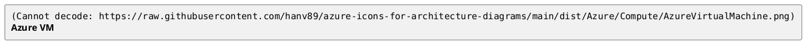

# Azure Icons for Architecture Diagrams

Microsoft Azure architecture icons in PNG, ready for diagram-as-code via PlantUML's `` syntax.

## What's inside

This repository hosts 528 PNG icons across 22 Azure categories (`AIMachineLearning`, `Analytics`, `Compute`, `Containers`, `Networking`, `Storage`, ...), sourced from the [Azure-PlantUML](https://github.com/plantuml-stdlib/Azure-PlantUML) upstream (MIT-licensed) and redistributed here under MIT for convenience. Each icon ships in two variants: a colored version (e.g. `AzureVirtualMachine.png`) and a monochrome version (e.g. `AzureVirtualMachine(m).png`). See [`NOTICE`](NOTICE) for full attribution.

## Use it

The icons are reachable as raw URLs from this repository, so any PlantUML renderer (the public `plantuml.com` server, the Confluence app, the VS Code extension, GitHub's inline renderer) can fetch them at render time. Use literal URLs inside `` tokens:

> **Do not use PlantUML `!define` macros for icon URLs.** A pattern like `!define IMG https://...` followed by `` does not expand inside the `` token and renders as a broken image on `play.plantuml.com` (verified during the v0.1.0 end-to-end demo). Paste the full URL.

Browse [`dist/Azure/`](dist/Azure/) on GitHub to find the path for any specific icon. Filenames containing `(` or `)` (the monochrome variants) must be URL-encoded as `%28` / `%29` when used inside a `` reference.

## License

- **Source code** in this repository (build script, future automation): MIT-licensed. See [`LICENSE`](LICENSE).
- **Icons**: the icons themselves are Microsoft trademarks. Their use is governed by the [Microsoft Azure Architecture Icons Terms of Use](https://learn.microsoft.com/en-us/azure/architecture/icons/) and the [Microsoft Trademark and Brand Guidelines](https://www.microsoft.com/en-us/legal/intellectualproperty/trademarks/usage/general). See [`NOTICE`](NOTICE) for full third-party attribution and the verbatim Terms snapshot captured at the time the icons were imported.

### By using these icons, you agree to Microsoft's Terms

By fetching, embedding, or otherwise using the Microsoft icons from this repository, you agree to the Microsoft Azure Architecture Icons Terms of Use linked above and to the Microsoft Trademark and Brand Guidelines. This repository propagates those terms; it does not, and cannot, modify them.

### Restrictions on icon use

Verbatim from Microsoft:

- Don't crop, flip, or rotate icons.
- Don't distort or change icon shape in any way.
- Don't use Microsoft product icons to represent your product or service.
- Use only for architectural diagrams, training materials, or documentation.

The same list lives co-located with the icons themselves at [`dist/Azure/USAGE-RULES.txt`](dist/Azure/USAGE-RULES.txt), where AI agents and scanners reading the icon directory are most likely to encounter it.

## Footer

This project is not affiliated with or endorsed by Microsoft Corporation. All Microsoft product names and icons are trademarks of Microsoft Corporation. See [`NOTICE`](NOTICE) for the full attribution chain.
