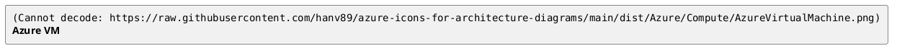

# Architecture-Diagram Icons (Azure · Fabric · Kubernetes · FluentUI · Devicon)

Cloud + dev-tool icons in PNG, ready for diagram-as-code via PlantUML's `` syntax. Five upstream sources — Microsoft Azure, Microsoft Fabric, Kubernetes (CNCF), Microsoft FluentUI System Icons, and Devicon dev-tool brand icons — redistributed from verified-license upstreams and reachable as public raw URLs so any PlantUML renderer (the public `plantuml.com` server, the Confluence app, the VS Code extension, GitHub's inline renderer) can fetch them at render time.

## Quick-start

Two ways to use these icons. Pick one.

### A — Install the AI skill (recommended)

Install the skill for your AI coding agent with one `npx` command:

```bash
# Claude Code
npx @hanv89/azure-arch-skill@latest install --agent=claude-code

# Codex CLI
npx @hanv89/azure-arch-skill@latest install --agent=codex

# Cursor
npx @hanv89/azure-arch-skill@latest install --agent=cursor
```

Where each agent installs the skill:

| Agent | Install location | Model |
|---|---|---|
| Claude Code | `~/.claude/skills/azure-architecture-diagram/` | per-user |
| Codex CLI | `~/.codex/skills/azure-architecture-diagram/` | per-user |
| Cursor | `<cwd>/.cursor/rules/azure-arch-skill.mdc` | per-project — see [CLI reference](#cli-reference) |

To install for every supported agent at once, use `--agent=all` (see [CLI reference](#cli-reference)).

Then in a new agent session (the example below uses Claude Code), prompt:

> Draw a system architecture diagram for an Azure AKS app feeding a Microsoft Fabric data plane (Lakehouse + Power BI).

```plantuml
@startuml
' System architecture (C4 level 2) — Azure AKS application feeding a
' Microsoft Fabric data plane.

left to right direction
skinparam linetype ortho

title Azure AKS application + Microsoft Fabric data plane

actor "End user" as user
actor "Data analyst" as analyst

rectangle "AKS application (Azure)" as aks_app {
  rectangle "<img:https://raw.githubusercontent.com/hanv89/azure-icons-for-architecture-diagrams/main/dist/Azure/Networking/AzureFrontDoor.png>\n**Front Door**\n(entry + WAF)" as fd
  rectangle "<img:https://raw.githubusercontent.com/hanv89/azure-icons-for-architecture-diagrams/main/dist/Azure/Containers/AzureKubernetesService.png>\n**AKS cluster**\n(microservices)" as aks
  rectangle "<img:https://raw.githubusercontent.com/hanv89/azure-icons-for-architecture-diagrams/main/dist/Azure/Databases/AzureSqlDatabase.png>\n**Azure SQL Database**\n(OLTP state)" as sql
  rectangle "<img:https://raw.githubusercontent.com/hanv89/azure-icons-for-architecture-diagrams/main/dist/Azure/Integration/AzureServiceBus.png>\n**Service Bus**\n(async messaging)" as sb
  rectangle "<img:https://raw.githubusercontent.com/hanv89/azure-icons-for-architecture-diagrams/main/dist/Azure/Databases/AzureRedisCache.png>\n**Cache for Redis**\n(cache)" as redis
  rectangle "<img:https://raw.githubusercontent.com/hanv89/azure-icons-for-architecture-diagrams/main/dist/Azure/Containers/AzureContainerRegistry.png>\n**Container Registry**\n(images)" as acr
}

rectangle "Platform services" as platform {
  rectangle "<img:https://raw.githubusercontent.com/hanv89/azure-icons-for-architecture-diagrams/main/dist/Azure/Identity/AzureActiveDirectory.png>\n**Microsoft Entra ID**\n(workload identity)" as entra
  rectangle "<img:https://raw.githubusercontent.com/hanv89/azure-icons-for-architecture-diagrams/main/dist/Azure/Security/AzureKeyVault.png>\n**Azure Key Vault**\n(secrets via CSI)" as kv
  rectangle "<img:https://raw.githubusercontent.com/hanv89/azure-icons-for-architecture-diagrams/main/dist/Azure/Management/AzureMonitor.png>\n**Azure Monitor**\n(observability)" as mon
}

rectangle "<img:https://raw.githubusercontent.com/hanv89/azure-icons-for-architecture-diagrams/main/dist/Fabric/png/fabric_48_color.png>\n**Microsoft Fabric workspace**" as fabric_ws {
  rectangle "<img:https://raw.githubusercontent.com/hanv89/azure-icons-for-architecture-diagrams/main/dist/Fabric/png/one_lake_48_color.png>\n**OneLake**\n(Delta foundation)" as onelake
  rectangle "<img:https://raw.githubusercontent.com/hanv89/azure-icons-for-architecture-diagrams/main/dist/Fabric/png/mirrored_catalog_40_item.png>\n**Mirrored Catalog**\n(zero-ETL Delta)" as mirror
  rectangle "<img:https://raw.githubusercontent.com/hanv89/azure-icons-for-architecture-diagrams/main/dist/Fabric/png/eventstream_40_item.png>\n**Eventstream**\n(real-time)" as estream
  rectangle "<img:https://raw.githubusercontent.com/hanv89/azure-icons-for-architecture-diagrams/main/dist/Fabric/png/lakehouse_40_item.png>\n**Lakehouse**\n(bronze/silver/gold)" as lake
  rectangle "<img:https://raw.githubusercontent.com/hanv89/azure-icons-for-architecture-diagrams/main/dist/Fabric/png/notebook_40_item.png>\n**Notebook**\n(Spark transform)" as notebook
  rectangle "<img:https://raw.githubusercontent.com/hanv89/azure-icons-for-architecture-diagrams/main/dist/Fabric/png/data_warehouse_40_item.png>\n**Data Warehouse**\n(T-SQL gold)" as wh
  rectangle "<img:https://raw.githubusercontent.com/hanv89/azure-icons-for-architecture-diagrams/main/dist/Fabric/png/semantic_model_40_item.png>\n**Semantic Model**\n(dimensional layer)" as sem
  rectangle "<img:https://raw.githubusercontent.com/hanv89/azure-icons-for-architecture-diagrams/main/dist/Fabric/png/power_bi_48_color.png>\n**Power BI**\n(consumption)" as pbi
  rectangle "<img:https://raw.githubusercontent.com/hanv89/azure-icons-for-architecture-diagrams/main/dist/Fabric/png/report_40_item.png>\n**Report**" as report
}

onelake -[hidden]- mirror
onelake -[hidden]- lake
onelake -[hidden]- wh

user --> fd : "HTTPS"
fd --> aks : "routes to ingress"
aks --> sql : "OLTP reads/writes"
aks --> sb : "publish events"
aks --> redis : "cache"
acr --> aks : "pulls images"

entra --> aks : "workload identity"
kv --> aks : "secrets (CSI)"
aks --> mon : "logs + metrics"
sql --> mon : "diagnostics"

sql --> mirror : "Mirroring\n(zero-ETL)"
sb --> estream : "real-time events"

mirror --> lake
estream --> lake
lake <--> notebook : "Spark transform"
lake --> wh : "curate to gold"
wh --> sem : "dimensional model"
sem --> pbi
pbi --> report

report --> analyst : "reads dashboards"

@enduml
```

You get back a `.puml` like the one below. Paste it into <https://www.plantuml.com/plantuml/uml/> or your Confluence PlantUML app, and you see:


<details>
<summary>Source: <code>03-system-architecture.puml</code></summary>



</details>

The canonical example also ships inside the installed skill at `~/.claude/skills/azure-architecture-diagram/examples/03-system-architecture.puml` along with five companion examples covering context, data pipeline, sequence flow, component view, and multi-region deployment.

### B — Hand-write `` (no agent needed)

Reference any icon by its public raw URL inside a literal `` token:



Browse [`dist/Azure/`](dist/Azure/) and [`dist/Fabric/png/`](dist/Fabric/png/) on GitHub to find the path for any specific icon.

> **Do not use PlantUML `!define` macros for icon URLs.** A pattern like `!define IMG https://...` followed by `` does not expand inside the `` token and renders as a broken image on `play.plantuml.com`. Paste the full URL.

Azure filenames containing `(` or `)` (the monochrome variants) must be URL-encoded as `%28` / `%29` when used inside a `` reference. Fabric filenames use `snake_case` and need no encoding.

### C — Chat-UI agents (Claude.ai Project + ChatGPT Custom GPT)

If your primary surface is a chat-UI rather than a CLI/IDE, install the skill into a chat-UI agent's knowledge base via a downloadable bundle ZIP. The bundle ships with every skill release on the [Releases page](https://github.com/hanv89/azure-icons-for-architecture-diagrams/releases) as `chat-ui-bundle.zip`. Setup recipes:

- **Claude.ai Project** — [`docs/chat-ui-distribution/claude-project/`](docs/chat-ui-distribution/claude-project/)
- **ChatGPT Custom GPT** — [`docs/chat-ui-distribution/chatgpt-gpt/`](docs/chat-ui-distribution/chatgpt-gpt/)

Both recipes upload the same bundle (SKILL.md + per-vendor INDEX catalogs + worked examples + per-vendor USAGE-RULES + NOTICE) as the agent's knowledge files, then paste a short system prompt that routes the model to SKILL.md.

### Mermaid mode (two sub-modes)

The skill is **PlantUML-first**, but **Mermaid can show the vendor icons too** — via inline HTML node labels — when rendered by a real browser engine. Two sub-modes (see SKILL.md § "Mermaid mode"):

- **Icon-light** — for diagrams that render **inline on GitHub** (GitHub sanitises Mermaid and strips inline ``): text labels only. See [`examples/11-mermaid-architecture.mmd`](dist/skill/examples/11-mermaid-architecture.mmd).
- **Mermaid + icon (cli/local render)** — the default when you want icons; deliverable is a PNG/Confluence/doc. Inline `` labels + the shipped [`examples/assets/render-mermaid.sh`](dist/skill/examples/assets/render-mermaid.sh) (mermaid-cli with `--no-sandbox` + `htmlLabels`/`securityLevel:loose`) + [`examples/assets/icon.css`](dist/skill/examples/assets/icon.css). See [`examples/12-mermaid-icons.mmd`](dist/skill/examples/12-mermaid-icons.mmd). Icons appear under cli/browser render, **not** when viewing the `.mmd` on GitHub.

## IaC → diagram (experimental)

`scripts/iac_to_diagram.mjs` turns a **Terraform** file into a PlantUML
architecture diagram that uses this repo's Azure icons:

```bash
node scripts/iac_to_diagram.mjs path/to/main.tf > architecture.puml
# then render architecture.puml as usual (play.plantuml.com, Confluence, CI)
```

It extracts `resource "azurerm_<type>" "<name>"` blocks, maps known types to
Azure icons via [`scripts/fixtures/iac-azurerm-icon-map.tsv`](scripts/fixtures/iac-azurerm-icon-map.tsv),
and infers edges from Terraform references (`<type>.<name>`) between resources.

**Scope + limitations (experimental):**
- **Terraform `azurerm` only** (a curated subset of ~24 common resource types). Bicep / CloudFormation / AWS / GCP are not supported yet.
- **Best-effort regex extraction** — no HCL modules, `for_each`/`count`, interpolation, or data sources. Whole-line `#`/`//` comments are stripped before parsing, and braces inside `"..."` string values are handled; **but braces inside heredocs (`<<EOF`) are not** and can mis-slice blocks — sanity-check the output if your `.tf` uses heredocs.
- **Unknown resource types are not dropped** — they render as plain text-labelled nodes and are listed in a coverage report on stderr, so you can see what was and wasn't iconified.
- Pin the icon `git-ref` with `--ref <tag>` (e.g. `--ref icons-v1.4.0`) for output stable against a released icon snapshot; the default `main` tracks the latest icons. `--ref` is validated as a git ref.

This is a starting point for IaC-driven diagrams; coverage expands as the map grows. Contributions to the map table are welcome.

## CLI reference

`npx @hanv89/azure-arch-skill@latest <command> [flags]`

### Commands

| Command | What it does |
|---|---|
| `install` | Fetches the skill bundle and writes it to the agent's skill folder. |
| `update` | Re-fetches and overwrites — but is an idempotent no-op when the installed version already matches the source. |
| `uninstall` | Removes the skill. Manifest-scoped: only the files the installer wrote are removed; anything you added alongside is left in place. |
| `list` | Reports which agents currently have the skill installed and at what version. |

### Flags

**`--agent=<claude-code\|codex\|cursor\|all>`** — which agent to act on. `--agent=all` fans out across all three:

- `install` / `update` with `--agent=all` are **transactional** — if one agent fails, the already-applied agents are rolled back, so you never end up half-installed.
- `uninstall` / `list` with `--agent=all` are **best-effort** — a failure on one agent does not stop the others.
- `install --agent=all` **refuses** as soon as it finds an agent that already has the skill, rather than silently skipping or overwriting. If your agents are in mixed states (some installed, some not), install them one at a time with explicit `--agent=` values.

**`--version=X.Y.Z`** — pins the bundle source to a specific `skill-vX.Y.Z` release tag. Without it, the CLI resolves the bundle from `main` (the latest published content).

**`--target=<path>`** — overrides the directory the skill is written to.

> **Cursor installs per-project, not per-user.** Unlike Claude Code and Codex CLI — which install into a per-user folder under your home directory — Cursor's default target is `<current working directory>/.cursor/rules/`. This is intentional: Cursor rules are scoped to a workspace, so the skill belongs with the project you run the command in. Run the install from your project root, or pass `--target=<path>` to point somewhere else.

## Troubleshooting

**An icon renders as a broken image.** Two common causes:

- A `!define` macro was used for the URL. PlantUML does not expand macros inside the `` token — paste the full literal URL (see the note in *Hand-write ``* above).
- The icon is an Azure monochrome variant whose filename contains `(` `)`. Those must be URL-encoded as `%28` / `%29` inside the `` reference. Fabric `snake_case` filenames need no encoding.

**`install` reports an icons-version mismatch.** The skill declares a `requires_icons` range in its frontmatter, and the CLI checks it before installing. The message tells you which icon release the skill expects. The icon library and the skill ship on independent tracks (`icons-v*` and `skill-v*`) — pin a compatible pair, or update whichever side is behind.

**The agent doesn't seem to use the skill after install.** Start a fresh agent session. Agents read their skill / rules folder at session start, so an install made during a running session is not picked up until you restart it.

**Cursor: I can't find where the skill was installed.** Cursor installs per-project — the rule file is at `.cursor/rules/azure-arch-skill.mdc` *inside the directory you ran the command from*, not in a global location. Run `list --agent=cursor` from that same directory, or see the per-project note in the [CLI reference](#cli-reference).

## Project status

The icon library is at `icons-v1.4.0` and the skill bundle (plus its npm package `@hanv89/azure-arch-skill`) is at `skill-v1.6.2`. The two tracks are independent and versioned separately, tied together by the skill's `requires_icons` range. The skill also supports a Mermaid mode (vendor icons via inline HTML under cli render; icon-light on GitHub) + an experimental Terraform→PlantUML generator (see § "Mermaid mode" and § "IaC → diagram").

Both tracks carry a SemVer compatibility commitment: within the `1.x` line, the CLI flag surface and the skill's install contract will not break — breaking changes wait for `2.0.0`. The icon library follows the same SemVer discipline on its own track.

The skill is also distributable to chat-UI agents (Claude.ai Project + ChatGPT Custom GPT) via the downloadable `chat-ui-bundle.zip` attached to each skill release — see [§ Quick-start C](#c--chat-ui-agents-claudeai-project--chatgpt-custom-gpt) and [`docs/chat-ui-distribution/`](docs/chat-ui-distribution/).

## Icon sources

This repository redistributes icons from five upstream sources, each with a verified license grant (see [`NOTICE`](NOTICE) for the full per-source attribution chain):

- **Microsoft Azure architecture icons** — via the [Azure-PlantUML](https://github.com/plantuml-stdlib/Azure-PlantUML) community redistribution (MIT). Pin: [`dist/Azure/UPSTREAM-SHA.txt`](dist/Azure/UPSTREAM-SHA.txt). 528 PNGs across 22 categories, each in two variants: colored (`AzureVirtualMachine.png`) and monochrome (`AzureVirtualMachine(m).png`).
- **Microsoft Fabric icons** — via the [`@fabric-msft/svg-icons`](https://www.npmjs.com/package/@fabric-msft/svg-icons) npm package (Microsoft first-party, MIT). Pin: [`dist/Fabric/UPSTREAM-VERSION.txt`](dist/Fabric/UPSTREAM-VERSION.txt). 312 PNGs across 5 sizes and four families (`_item`, `_non-item`, `_color`, plain).
- **Kubernetes icons** — via [`kubernetes/community`](https://github.com/kubernetes/community/tree/master/icons) (CNCF / Linux Foundation, Apache-2.0 OR CC-BY-4.0 dual grant). Pin: [`dist/Kubernetes/UPSTREAM-SHA.txt`](dist/Kubernetes/UPSTREAM-SHA.txt). 148 PNGs (control-plane + workload resource icons). `Kubernetes` is a registered Linux Foundation trademark — see the [LF Trademark Usage](https://www.linuxfoundation.org/trademark-usage/) policy.
- **Microsoft FluentUI System Icons** — via [`microsoft/fluentui-system-icons`](https://github.com/microsoft/fluentui-system-icons) (Microsoft first-party, MIT). Pin: [`dist/FluentUI/UPSTREAM-SHA.txt`](dist/FluentUI/UPSTREAM-SHA.txt). 75 PNGs — a curated decorator subset (25 concepts × 3 sizes, `_color` variant).
- **Devicon dev-tool icons** — via [`devicons/devicon`](https://github.com/devicons/devicon) (community-maintained, MIT, © 2015 konpa). Pin: [`dist/Devicon/UPSTREAM-SHA.txt`](dist/Devicon/UPSTREAM-SHA.txt). 149 PNGs — a curated dev-tool brand mosaic (`-original` variant at 48px). Each icon depicts a third-party brand whose trademark policy applies separately to *use*; Devicon's MIT grant covers redistribution of the icon files only.

Each vendor directory ships a `USAGE-RULES.txt` co-located with the icons (where AI agents and scanners reading the directory are most likely to encounter it).

## License

- **Source code** in this repository (CLI, build scripts, workflows): MIT-licensed. See [`LICENSE`](LICENSE).
- **Icons**: redistributed under each upstream's license, with trademark layers preserved per source. See [`NOTICE`](NOTICE) for the full attribution chain and the verbatim Terms snapshots captured at import time:
  - **Microsoft Azure + Fabric + FluentUI** — governed by the relevant Microsoft Terms of Use ([Azure Architecture Icons ToU](https://learn.microsoft.com/en-us/azure/architecture/icons/), Fabric icon ToU) plus the [Microsoft Trademark and Brand Guidelines](https://www.microsoft.com/en-us/legal/intellectualproperty/trademarks/usage/general). File licensing is MIT (Fabric + FluentUI are first-party MIT; Azure via the Azure-PlantUML MIT mirror).
  - **Kubernetes** — Apache-2.0 OR CC-BY-4.0 dual grant; `Kubernetes` trademark per the [LF Trademark Usage](https://www.linuxfoundation.org/trademark-usage/) policy.
  - **Devicon** — MIT (community-maintained). Each icon depicts a third-party brand; the depicted brands' trademark policies apply separately to use.

### By using these icons, you agree to the applicable upstream terms

By fetching, embedding, or otherwise using icons from this repository, you agree to the upstream license + trademark terms for the relevant vendor (above). This repository propagates those terms; it does not, and cannot, modify them.

### Restrictions on icon use

For the **Microsoft** tracks (Azure, Fabric, FluentUI), verbatim from Microsoft:

- Don't crop, flip, or rotate icons.
- Don't distort or change icon shape in any way.
- Don't use Microsoft product icons to represent your product or service.
- Use only for architectural diagrams, training materials, or documentation.

For **Kubernetes** and **Devicon**, the underlying licenses (Apache-2.0/CC-BY-4.0 and MIT respectively) carry no equivalent use-restriction; the constraint is trademark-only (don't imply endorsement, label the icon with the depicted product's name). Each vendor's `dist/<Vendor>/USAGE-RULES.txt` states its specific rules — Azure ([`dist/Azure/USAGE-RULES.txt`](dist/Azure/USAGE-RULES.txt)), Fabric ([`dist/Fabric/USAGE-RULES.txt`](dist/Fabric/USAGE-RULES.txt)), Kubernetes ([`dist/Kubernetes/USAGE-RULES.txt`](dist/Kubernetes/USAGE-RULES.txt)), FluentUI ([`dist/FluentUI/USAGE-RULES.txt`](dist/FluentUI/USAGE-RULES.txt)), Devicon ([`dist/Devicon/USAGE-RULES.txt`](dist/Devicon/USAGE-RULES.txt)).

## Contributing

Bug reports and feature requests go to the [GitHub issue tracker](https://github.com/hanv89/azure-icons-for-architecture-diagrams/issues).

- **Broken raw URL or missing icon** — open an issue with the exact `` that failed and where you used it (Confluence, `play.plantuml.com`, GitHub, …). Icon URLs are pinned by tag, so include the tag or `main`.
- **Proposing a new icon** — note that every icon here is redistributed unchanged from a verified-license upstream (Azure-PlantUML for Azure, `@fabric-msft/svg-icons` for Fabric, `kubernetes/community` for Kubernetes, `microsoft/fluentui-system-icons` for FluentUI, `devicons/devicon` for Devicon). New icons have to come from a comparable source — say which upstream covers the icon you want, and we can audit it.

### Local setup (one-time per clone)

```bash
make setup
```

This points `git` at the in-tree pre-push hook (`.githooks/pre-push`) so the leak-check workflow's catches also run locally before any push reaches GitHub, and confirms `node`, `npm`, and `gh` are installed. See the [Makefile](Makefile) for additional smoke-test targets.

## Footer

This project is not affiliated with or endorsed by Microsoft Corporation. All Microsoft product names and icons are trademarks of Microsoft Corporation. See [`NOTICE`](NOTICE) for the full attribution chain.
