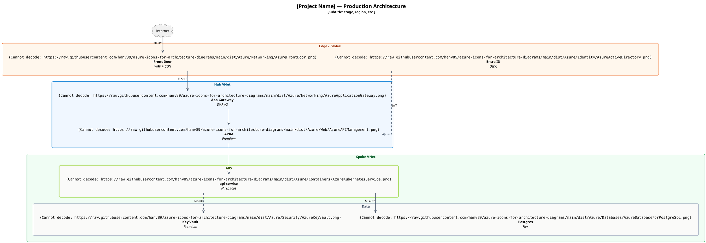

# Azure Architecture Diagram Skill (PlantUML)

This skill describes how to draw Azure architecture diagrams with PlantUML, using icons from the `hanv89/azure-icons-for-architecture-diagrams` repository.

## When to use

Use this skill for:
- Reference architecture documents (Confluence pages)
- Technical design documents (TDD)
- Pre-RFC architecture proposals
- Production runbook diagrams
- Multi-region deployment topologies

Do NOT use this skill for:
- UI mockups (use Figma / draw.io)
- Network packet flow diagrams (use Wireshark)
- Database ER diagrams (use dbdiagram.io or PlantUML's separate ER syntax)

## Microsoft icon use rules (read before authoring)

> **By referencing or redistributing Microsoft Azure architecture icons via this skill, you agree to the [Microsoft Azure Architecture Icons Terms of Use](https://learn.microsoft.com/en-us/azure/architecture/icons/) and the [Microsoft Trademark and Brand Guidelines](https://www.microsoft.com/en-us/legal/intellectualproperty/trademarks/usage/general). This skill does not transfer or sublicense Microsoft's trademarks; it propagates Microsoft's terms unchanged.**

The icons referenced by this skill are Microsoft trademarks. Their use is governed by the Microsoft Azure Architecture Icons Terms of Use and the Microsoft Trademark and Brand Guidelines (linked above). The repository's `dist/Azure/USAGE-RULES.txt` and `NOTICE` files re-state these terms in human-readable form; this section binds them into the diagrams an AI agent emits.

### Verbatim Don'ts (from Microsoft)

- Don't crop, flip, or rotate icons.
- Don't distort or change icon shape in any way.
- Don't use Microsoft product icons to represent your product or service.

Use the icons only for architectural diagrams, training materials, or documentation. Always show the product name as a label adjacent to the icon (this is a Microsoft Do).

### Anti-example (do NOT emit) and corrected version

```plantuml
' WRONG — this rotates the Front Door icon, violating MS ToU.
rectangle "\nAzure Front Door" as fd
fd -[hidden]-> fake_anchor : "rotate=45 — never do this"
' (PlantUML doesn't have a rotate primitive on , but if it did, it would be off-limits.
'  The same rule applies to recoloring, mirroring (`flip`), or scaling the icon non-uniformly.)
```

```plantuml
' RIGHT — icon used as-published, with the product name labelled next to it.
rectangle "\nAzure Front Door" as fd
```

If a downstream PlantUML rendering pipeline applies a global transform that would crop / flip / rotate Microsoft icons, the agent must explicitly disable it for icon images, even if that means refusing to emit the diagram and asking the user to remove the offending pipeline step.

## Setup

Every diagram should include 3 setup blocks. Use **literal URLs** in every `` reference (see § "Do not use `!define` macros for icon URLs" below).

```plantuml
@startuml DiagramName

' 1. Skinparam: layout, fonts, default colors
top to bottom direction
skinparam linetype ortho
skinparam ranksep 60
skinparam nodesep 50
skinparam shadowing false
skinparam roundcorner 10
skinparam defaultFontName "Inter, Arial, sans-serif"
skinparam defaultFontSize 13
skinparam defaultTextAlignment center
skinparam ArrowColor #475569
skinparam ArrowFontSize 11
hide stereotype

' 2. Icon container - transparent (icons float freely without a frame)
skinparam rectangle {
  BackgroundColor transparent
  BorderColor transparent
  FontColor #1F2937
}

' 3. Cluster styles - define stereotype for each group type
skinparam rectangle<<edge>> {
  BackgroundColor #FFF7ED
  BorderColor #EA580C
  FontColor #9A3412
}
skinparam rectangle<<vnet>> {
  BackgroundColor #F0F7FF
  BorderColor #0078D4
  FontColor #075985
}
' ... (see full palette in § Common patterns reference below)
```

## Icon URLs

Reference each icon with its full literal URL inside a `` token. The base URL pattern is:

```
https://raw.githubusercontent.com/hanv89/azure-icons-for-architecture-diagrams/main/dist/Azure/<Category>/<ServiceName>.png
```

Example references:

```plantuml
' Azure core services (paste the full URL into ; do not abbreviate with macros — see below)


```

### Finding the right icon (use the INDEX)

Every icon ships with a flat markdown catalog you can grep. Each row carries the path, a human name, a description, and tags so you can look up the right `<Category>/<file>.png` without guessing.

- Azure: <https://raw.githubusercontent.com/hanv89/azure-icons-for-architecture-diagrams/main/dist/Azure/INDEX.md>
- Fabric: <https://raw.githubusercontent.com/hanv89/azure-icons-for-architecture-diagrams/main/dist/Fabric/INDEX.md>
- Kubernetes: <https://raw.githubusercontent.com/hanv89/azure-icons-for-architecture-diagrams/main/dist/Kubernetes/INDEX.md>

When the user names a service, **fetch the relevant INDEX.md once at the start of a session, search it (case-insensitive substring or tag match across name + description + tags), and use the `path` column from the matching row** verbatim in your `` token. Prefer this over guessing a filename from the product name — Microsoft's canonical filenames sometimes diverge from common usage (e.g. `Azure Cache for Redis` lives at `dist/Azure/Databases/AzureRedisCache.png`, `Microsoft Entra ID` at `dist/Azure/Identity/AzureActiveDirectory.png`).

The category-level directory listing is still useful for browsing: `https://github.com/hanv89/azure-icons-for-architecture-diagrams/tree/main/dist/Azure`.

### Filenames with parentheses (URL encoding required)

Microsoft Fabric and some Azure icons ship a colored-and-monochrome pair. The monochrome variants carry an `(m)` suffix in their filename, for example:

| Disk filename | Encoded URL form |
|---|---|
| `AzureBatchAI.png` | `AzureBatchAI.png` (no encoding needed) |
| `AzureBatchAI(m).png` | `AzureBatchAI%28m%29.png` |

Parentheses (`(`, `)`) must be URL-encoded as `%28` / `%29` inside the `` token. The PlantUML server fetches the URL as-is; literal parens break the URL. Worked example:

```plantuml
' Monochrome Front Door variant — note %28m%29 in place of (m)

```

The same rule applies to any other special URL characters (`@` becomes `%40`, spaces become `%20`, etc.). Microsoft icon filenames in this repo only use `(` `)` and ASCII letters/digits, so `%28` / `%29` are the only encodings the agent normally needs.

### Do not use `!define` macros for icon URLs

PlantUML's preprocessor does not substitute `!define` symbols inside the `` token. Macro indirection produces broken images at render time without any error message. Always use literal URLs.

```plantuml
' WRONG — !define IMG is NOT expanded inside ; the renderer fetches
' the literal string "IMG/Compute/AzureAppService.png" and produces a broken image.
!define IMG https://raw.githubusercontent.com/hanv89/azure-icons-for-architecture-diagrams/main/dist/Azure

```

```plantuml
' RIGHT — full literal URL inside ; the renderer fetches the URL as-is.

```

This rule was discovered while authoring `examples/01-context.puml` — the macro form silently produced broken images on `play.plantuml.com`; switching to literal URLs fixed it.

## Microsoft Fabric icons

This skill also covers Microsoft Fabric — the data engineering / analytics platform — using icons sourced from the `@fabric-msft/svg-icons` npm package (Microsoft first-party, MIT license). Fabric icons live under:

```
https://raw.githubusercontent.com/hanv89/azure-icons-for-architecture-diagrams/main/dist/Fabric/png/
```

Two icon families, two abstraction levels:

**Family A — per-artifact icons (`_item` / `_non-item` / plain).** Per-service icons that represent individual artifacts inside a Fabric workspace (Lakehouse, Pipeline, Notebook, KQL DB, ...). Available at sizes 24, 32, 40, 48 with three suffix conventions:

- `<base>_<size>_item.png` — primary service items (most icons).
- `<base>_<size>_non-item.png` — secondary forms: workspaces, folders, action verbs (MyWorkspace, GroupWorkspace, Folder, AddPipeline, ImportNotebook, Sample, EventHouse-alt).
- `<base>_<size>.png` — special-form services with no item suffix (graph_model, graph_queryset).

Pick `_40_item` for most architecture diagrams (default size — the v0.2.0 set). Use 24/32 for compact layouts; 48 for hero blocks.

**Family B — per-experience workload icons (`_color`).** Color brand icons that represent Fabric experiences (the panes in the Fabric portal) — distinct from the per-artifact icons inside them. URL: `<workload>_<size>_color.png` where `<size>` ∈ {24, 28, 32, 48}.

13 workload bases: `copilot`, `databases`, `data_engineering`, `data_factory`, `data_science`, `data_warehouse`, `fabric` (umbrella brand), `graph_intelligence`, `industry_solutions`, `one_lake`, `power_bi`, `purview`, `real_time_intelligence`.

Use these for the **experience-level** layer in a Fabric architecture (the Data Engineering pane, the OneLake foundation, the Power BI consumption layer).

**Pair Family A + Family B on the same diagram**, do not collapse them. Each consumption / experience pane gets a Family B `_color` icon for the pane label; each individual artifact inside that pane gets a Family A `_item` icon. The mapping is fixed by Microsoft's reference architectures:

| When you draw …                        | Workload pane (Family B `_color`)   | Artifact(s) inside (Family A `_item`)                                    |
|----------------------------------------|--------------------------------------|--------------------------------------------------------------------------|
| OneLake storage foundation             | `one_lake_48_color.png`              | `lakehouse_40_item.png`, `data_warehouse_40_item.png`, `mirrored_catalog_40_item.png` |
| Data Engineering (Spark notebooks)     | `data_engineering_48_color.png`      | `notebook_40_item.png`, `lakehouse_40_item.png`, `spark_job_direction_40_item.png` |
| Data Factory (orchestration)           | `data_factory_48_color.png`          | `pipeline_40_item.png`, `dataflow_gen2_40_item.png`, `copy_job_40_item.png` |
| Data Warehouse (T-SQL)                 | `data_warehouse_48_color.png`        | `data_warehouse_40_item.png`                                              |
| Data Science (ML)                      | `data_science_48_color.png`          | `notebook_40_item.png`, `experiments_40_item.png`, `model_40_item.png`   |
| Real-Time Intelligence                 | `real_time_intelligence_48_color.png`| `eventstream_40_item.png`, `event_house_40_item.png`, `kql_database_40_item.png`, `real_time_dashboard_40_item.png` |
| Databases (mirroring / SQL DB)         | `databases_48_color.png`             | `mirrored_catalog_40_item.png`, `mirrored_generic_database_40_item.png`, `sql_database_40_item.png` |
| Power BI consumption                   | `power_bi_48_color.png`              | `report_40_item.png`, `semantic_model_40_item.png`, `dashboard_40_item.png` |
| Graph Intelligence                     | `graph_intelligence_48_color.png`    | `graph_model_40.png`, `graph_queryset_40.png`                            |

**DO**: in system architecture / component diagrams, draw the workload pane as the cluster boundary (or as a separate rectangle with the Family B icon as the label) AND draw each artifact inside as its own rectangle with the Family A icon.

**DO**: in sequence diagrams, when one participant must carry both concepts, stack the two icons inside the participant header so the workload context is visible alongside the artifact:

```plantuml
participant "\n\n**Power BI Report**" as pbi
```

**DON'T**: collapse the two icons into one. Using only `report_40_item.png` and labeling it "Power BI Report" hides the workload context Microsoft draws explicitly. Same anti-pattern for `notebook_40_item.png` alone labelled "Spark Notebook" — pair it with `data_engineering_48_color.png` so the workload context is visible.

**DON'T**: use only the Family B `_color` icon for a node that represents one concrete artifact (e.g. a single Lakehouse). Use the Family A `_item` icon when you mean a specific instance; reserve Family B for the surrounding pane / experience boundary.

Total: 312 Fabric icons at `icons-v0.2.2` (65 size-40 Family A + 247 size-24/28/32/48 Family A+B). PlantUML scales them automatically inside `` tokens.

### Common Fabric items reference (Family A)

| Service | Filename | Use case |
|---|---|---|
| Lakehouse | `lakehouse_40_item.png` | Storage layer for Bronze/Silver/Gold (Delta) |
| Pipeline | `pipeline_40_item.png` | Data orchestration |
| Notebook | `notebook_40_item.png` | Spark / Python transformation |
| Data Warehouse | `data_warehouse_40_item.png` | Serving Gold via T-SQL |
| Data Factory | `data_factory_40_item.png` | Parent ETL platform |
| Dataflow Gen2 | `dataflow_gen2_40_item.png` | Power Query data flows |
| Eventstream | `eventstream_40_item.png` | Real-time ingest |
| Event House (KQL DB) | `event_house_40_item.png` | KQL-queried event store |
| Semantic Model | `semantic_model_40_item.png` | Power BI / analytics semantic layer |
| Report | `report_40_item.png` | Power BI report |
| Mirrored Catalog | `mirrored_catalog_40_item.png` | Mirrored external catalog (Unity, Snowflake, etc.) |
| Graph Model | `graph_model_40.png` | Graph data model |
| Graph Queryset | `graph_queryset_40.png` | Graph queryset |
| My Workspace | `my_workspace_40_non-item.png` | Personal tenant workspace container |
| Group Workspace | `group_workspace_40_non-item.png` | Shared workspace container |
| Folder | `folder_40_non-item.png` | Workspace folder grouping |

### Common Fabric workloads reference (Family B, `_color`)

| Workload | Filename (size 48) | Use case |
|---|---|---|
| Fabric (umbrella brand) | `fabric_48_color.png` | Tenant boundary / Fabric platform group |
| OneLake | `one_lake_48_color.png` | Foundation lake storage layer |
| Data Engineering | `data_engineering_48_color.png` | Spark + Lakehouse experience |
| Data Factory | `data_factory_48_color.png` | Pipeline + Dataflow experience |
| Data Warehouse | `data_warehouse_48_color.png` | SQL warehouse experience |
| Data Science | `data_science_48_color.png` | ML experiment + model experience |
| Real-Time Intelligence | `real_time_intelligence_48_color.png` | KQL DB + Eventstream experience |
| Power BI | `power_bi_48_color.png` | Report + dashboard consumption layer |
| Databases | `databases_48_color.png` | Fabric Databases (mirrored + SQL DB) |
| Graph Intelligence | `graph_intelligence_48_color.png` | Graph model + queryset experience |
| Industry Solutions | `industry_solutions_48_color.png` | Vertical-specific bundles (healthcare, retail, sustainability) |
| Purview | `purview_48_color.png` | Governance + catalog |
| Copilot | `copilot_48_color.png` | Generative AI overlay |

Smaller workload sizes available: 24, 28, 32 — same naming pattern (`<base>_<size>_color.png`). Drop in for dense diagrams or sidebar legends.

312 Fabric icons ship at `icons-v0.2.2`. Browse the full set at: `https://github.com/hanv89/azure-icons-for-architecture-diagrams/tree/main/dist/Fabric/png`. See `dist/Fabric/USAGE-RULES.txt` for the Microsoft Fabric icon Don'ts (mirror of the Azure rules).

### Example references

```plantuml
' Fabric data engineering icons (literal URLs, same convention as Azure)


```

The Fabric icon filenames use `snake_case` (matching upstream `@fabric-msft/svg-icons` SVG names); none contain parentheses, so no URL encoding is needed.

### Mixing Azure + Fabric in one diagram

Fabric icons compose cleanly with Azure icons. Typical pattern: Azure infra surrounding a Fabric data plane (e.g. Azure Front Door → Azure App Service → Fabric Lakehouse via Fabric Pipeline → Fabric Notebook → Fabric Data Warehouse → Power BI report). See `examples/02-fabric-data-pipeline.puml` for a worked Fabric-only flow, and `examples/03-system-architecture.puml` for a full Azure AKS application feeding a Microsoft Fabric data plane (canonical Azure + Fabric mixed example).

## Kubernetes icons

Since `icons-v1.2.0`, the skill also covers Kubernetes — sourced from the upstream `kubernetes/community/icons` set (Apache-2.0 / CC-BY-4.0 dual licence, published by the Kubernetes project under CNCF / Linux Foundation governance). The aesthetic is hexagon-badge filled-glyph (blue badges with white concept-glyph inside), distinct from Azure's square filled-glyph but composes naturally inside an AKS / cluster boundary.

Kubernetes icons live under:

```
https://raw.githubusercontent.com/hanv89/azure-icons-for-architecture-diagrams/main/dist/Kubernetes/png/
```

Two style variants × two sizes × three subdir families:

- **Variants**: `labeled` (concept name embedded in the badge, e.g. "Pod") and `unlabeled` (badge with glyph only — pair with a PlantUML node label when composing).
- **Sizes**: `128` (smaller, closer to Azure's 64px feel) and `256` (larger headers + isolated icons).
- **Subdirs**: `resources/` (workload + config + network + storage + RBAC concepts), `control_plane_components/` (API server, scheduler, controller-manager, kubelet, kube-proxy, cloud-controller-manager), `infrastructure_components/` (Node, etcd, master).

Filename pattern: `<concept>-<size>.png`. The `<concept>` segment may contain dashes (e.g. `c-c-m-128.png` = Cloud Controller Manager, `k-proxy-128.png` = kube-proxy, `c-role-128.png` = ClusterRole). For the complete name + tag lookup table, fetch `dist/Kubernetes/INDEX.md` (148 rows — one per shipped PNG).

### Common Kubernetes references

```plantuml
' Kubernetes workload + config + network (labeled variant, 128px)


' Control plane (used inside an AKS / cluster boundary)


' Infrastructure (Node = worker, useful for showing pool topology)

```

Kubernetes filenames use plain ASCII with dashes — no URL encoding needed (no parentheses, no spaces).

### Mixing Azure + Kubernetes in one diagram

The canonical mixed pattern is **Azure AKS (managed Kubernetes) surrounding a Kubernetes workload subgraph**: Azure Front Door → Azure App Gateway → AKS cluster (containing Service → Deployment → Pods + ConfigMap + Secret) → Azure SQL Database. See `examples/07-azure-aks-mixed.puml` for a worked example.

## Pattern 1: System Architecture Diagram

For high-level deployment topology — hub-spoke, AKS, managed services.

**When to use**: Reference architecture in the main project document.

**Worked example**: see `examples/01-context.puml` for a minimal Azure 3-tier (Front Door → App Service → SQL Database) using exactly this pattern.

**Template** (using literal URLs throughout):



## Patterns 2-4 (sequence / component / deployment)

Pattern 1 (system architecture) is the central template above; the remaining patterns are illustrated through worked examples shipped in the same bundle:

- **Sequence flow** — `examples/04-sequence-flow.puml` traces a request across Front Door → AKS → Service Bus → Fabric Eventstream, exercising actor/lifeline/note syntax with Azure + Fabric icons.
- **Component view (C4 level 3)** — `examples/05-component.puml` zooms into the AKS cluster internals from `03-system-architecture.puml`, showing the microservices, sidecars, and platform-services hooks.
- **Deployment topology** — `examples/06-deployment.puml` shows a multi-region active-active deployment of the same architecture across paired Azure regions with Fabric workspace replication.

## Common patterns reference

### Cluster color palette

| Stereotype | Background | Border    | Text      | Use case |
|---|---|---|---|---|
| `<<edge>>`     | `#FFF7ED` | `#EA580C` | `#9A3412` | Internet-facing, CDN, WAF |
| `<<vnet>>`     | `#F0F7FF` | `#0078D4` | `#075985` | Hub VNet, networking |
| `<<spoke>>`    | `#F0FDF4` | `#16A34A` | `#166534` | Workload Spoke VNet |
| `<<aks>>`      | `#FAFAF9` | `#84CC16` | `#365314` | AKS cluster |
| `<<data>>`     | `#FAFAF9` | `#94A3B8` | `#475569` | Data layer (DB, cache, storage) |
| `<<ai>>`       | `#FAF5FF` | `#7E22CE` | `#6B21A8` | AI / Analytics |
| `<<security>>` | `#FEF2F2` | `#DC2626` | `#991B1B` | Security boundary, firewall |
| `<<dr>>`       | `#F1F5F9` | `#64748B` | `#334155` | DR region (passive) |

### Edge styling

```plantuml
' Solid arrow - synchronous call (default)
a --> b : "REST API"

' Dashed - async, optional, secondary
a ..> b : "secrets via MI"

' Bold + colored - highlight critical path
a -[#A0522D,bold]-> b : "egress traffic"

' Right direction (force horizontal in same group)
a -r-> b

' Hidden (force layout without showing edge)
a -[hidden]r- b
```

### Horizontal alignment within a group

By default, the Graphviz dot engine arranges nodes following the flow direction. To force nodes within a group to align horizontally (in a TB diagram), use **hidden right edges**:

```plantuml
rectangle "Group" {
  rectangle "A" as a
  rectangle "B" as b
  rectangle "C" as c

  ' Force horizontal alignment
  a -[hidden]r- b
  b -[hidden]r- c
}
```

### Two-line title with formatting

```plantuml
title <size:20><b>Project Name</b></size>\n<size:13>Subtitle, stage, version</size>\n
```

### Multi-line node label (with literal icon URL)

```plantuml
rectangle "\n**Display Name**\n//Subtitle italic//\n[Optional bracket]" as alias
```

## Confluence integration (PlantUML apps)

General workflow when using a PlantUML app in Confluence (e.g., AppsFoundry, weweave, or other apps):

1. In the Confluence editor, type `/plantuml` → select the **PlantUML Diagram** macro.
2. Paste source code into the text area.
3. Save → diagram renders via the PlantUML server (default plantuml.com).
4. Store the `.puml` source in the project's Git repo alongside related code.

**Important**:
- The default plantuml.com server runs PlantUML 1.2025+.
- URLs containing `(`, `)`, `@`, or spaces must be URL-encoded — `%28`, `%29`, `%40`, `%20` respectively. See § "Filenames with parentheses" above for the most common case in this skill.
- Complex diagrams render in ~5-10s on first load, cached afterwards.

## Authoring workflow

**Local development**:
1. VS Code + the `jebbs.plantuml` extension → press Alt+D for live preview.
2. Save `.puml` files in `docs/architecture/` of the project repo.
3. Commit alongside the corresponding code changes.

**Quick prototyping**:
- Browser: `https://www.plantuml.com/plantuml/uml/` → paste source → diagram renders inline.
- Live editing, share URL containing the encoded source.

**CI render (optional)**:
- GitHub Actions render `.puml` → PNG.
- Upload to Confluence as attachment fallback (in case the server fails).

## Troubleshooting

| Symptom | Cause | Fix |
|---|---|---|
| Icon renders as a broken-image placeholder | The `` URL contains an unexpanded `!define` macro | Replace the macro with the literal URL inside `` (see § "Do not use `!define` macros") |
| Icon broken on a monochrome variant only | Filename has `(m)` but URL was not encoded | Replace `(m)` with `%28m%29` in the URL |
| `(Unable to decode...)` | `@` character in URL is not encoded | Replace `@` with `%40` in the URL |
| `(Cannot decode SVG: ...)` | PlantUML can't parse SVG with gradients | Use the PNG version (path `Azure/.../service.png`) |
| Icon not visible, only label shows | URL fetch failed (404 or CORS) | Verify URL returns 200 with `curl -I`; check the icon path against `dist/Azure/<Category>/` browsable on GitHub |
| Layout broken, nodes overlapping | Diagram too complex for one layout | Split into multiple smaller diagrams (one per concern) |
| Render time > 30s | Diagram has >50 nodes or >4 nesting levels | Simplify; consider C4 model |
| Layout hard to control | Default dot engine has limited control | Use `together {}` or hidden edges |

## Extending the icon set

If an icon is **not available** in `hanv89/azure-icons-for-architecture-diagrams`:

1. **New Microsoft service**: Add to `dist/Azure/[Category]/` of the repo, push a PR.
2. **Internal logo / brand**: Add to `dist/Custom/` using kebab-case naming (e.g., `your-brand.png`).
3. **Third-party service**: Add to `dist/Custom/3rdparty/` with clear attribution.

PNG specs:
- Size: 70x70 px
- Format: PNG with alpha channel
- Background: Transparent
- DPI: 72 (standard web)

## Reference

- **This repository**: `https://github.com/hanv89/azure-icons-for-architecture-diagrams`
- **License**: MIT — see [`LICENSE`](../../LICENSE)
- **Third-party attribution + Microsoft ToU snapshot**: see [`NOTICE`](../../NOTICE)
- **Icon-use rules (human-readable)**: see [`USAGE-RULES.txt`](../Azure/USAGE-RULES.txt)
- **Microsoft Azure Architecture Icons Terms of Use**: `https://learn.microsoft.com/en-us/azure/architecture/icons/`
- **Microsoft Trademark and Brand Guidelines**: `https://www.microsoft.com/en-us/legal/intellectualproperty/trademarks/usage/general`
- **PlantUML docs**: `https://plantuml.com/`
- **Azure-PlantUML upstream (intermediate redistribution source)**: `https://github.com/plantuml-stdlib/Azure-PlantUML`
- **PlantUML web editor**: `https://www.plantuml.com/plantuml/uml/`

## Available examples

Renderable example diagrams live in `examples/` (file list mirrors `manifest.json`):

- [`01-context.puml`](examples/01-context.puml) — Azure 3-tier system context (Front Door → App Service → SQL Database).
- [`02-fabric-data-pipeline.puml`](examples/02-fabric-data-pipeline.puml) — Microsoft Fabric data-engineering pipeline (Eventstream → Lakehouse → Notebook → Warehouse → Power BI).
- [`03-system-architecture.puml`](examples/03-system-architecture.puml) — Azure AKS application feeding a Microsoft Fabric data plane (canonical Azure + Fabric mixed example, C4 level 2).
- [`04-sequence-flow.puml`](examples/04-sequence-flow.puml) — Request sequence across Azure Front Door → AKS → Service Bus → Fabric Eventstream.
- [`05-component.puml`](examples/05-component.puml) — AKS cluster internals (C4 level 3 zoom into the `03-system-architecture.puml` AKS box).
- [`06-deployment.puml`](examples/06-deployment.puml) — Multi-region active-active deployment with Fabric workspace replication.
- [`07-azure-aks-mixed.puml`](examples/07-azure-aks-mixed.puml) — Azure-fronted AKS deployment with a Kubernetes workload subgraph (Front Door + App Gateway → AKS Service → Deployment + Pods + ConfigMap + Secret → Azure SQL). Canonical Azure + Kubernetes mixed example, added in `icons-v1.2.0` / `skill-v1.2.0`.
